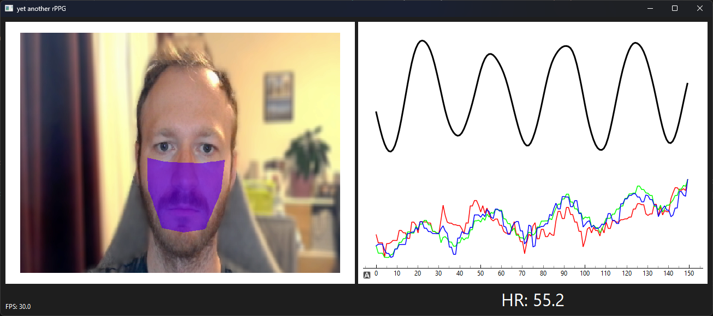

Yet another rPPG
================

*\* This is a work in progress! \**
-----------------------------------

**yarppg** is yet another implementation of remote photoplethysmography in
Python.  Remote photoplethysmography (rPPG) refers to the camera-based
measurement of a (blood volume) pulse signal.  It works by detecting small
changes in skin color, originating from the pulsation of blood [1]_.

Some other open-source implementations of rPPG:

* **heartbeat**: Live heart rate measurements. Written in C++ with a number of
  customization options (https://github.com/prouast/heartbeat)
* **Bob’s implementation of different rPPG algorithms**: Python implementation
  of different publications for offline evaluation.
  (https://www.idiap.ch/software/bob/docs/bob/bob.rppg.base/master/)

The current default implementation uses the bandpass-filtered green channel
averaged across a custom ROI suggested by Li et al. [2]_ Other features of
their algorithm are a work in progress.

Installation and usage
----------------------

In order to run this rPPG implementation, you first have to clone the
repository and make sure all requirements are installed.

.. code:: bash

   git clone https://github.com/SamProell/yarppg.git
   cd yarppg
   pip install -r requirements.txt

Now you can simply run the yarppg subfolder as a python package using the ``-m``
flag:

.. code:: bash

   python -m yarppg  # from yarppg top-level directory

Options
-------
There are a number of options available, when running yarppg:

+-----------------+----------+----------------------------------------------------------------+
| Option          | Default  |  Description                                                   |
+=================+==========+================================================================+
| --detector      | facemesh |  ROI (face) detector - choices: {facemesh,caffe-dnn,haar,full} |
+-----------------+----------+----------------------------------------------------------------+
| --processor     | LiCvpr   |  Processor translating ROI to pulse signal. LiCvpr currently   |
|                 |          |  only returns mean green value - choices: {LiCvpr,Pos,Chrom}   |
+-----------------+----------+----------------------------------------------------------------+
| --winsize       | 32       |  Window sized used in some processors (in frames)              |
+-----------------+----------+----------------------------------------------------------------+
| --bandpass      | 0.5,2    |  bandpass frequencies for processor output                     |
+-----------------+----------+----------------------------------------------------------------+
| --blobsize      | 150      |  quadratic blob size of DNN Face Detector                      |
+-----------------+----------+----------------------------------------------------------------+
| --draw-facemark | False    |  draw landmarks when using facemesh detector                   |
+-----------------+----------+----------------------------------------------------------------+
| --blur          |  -1      |  pixelation size of detected ROI                               |
+-----------------+----------+----------------------------------------------------------------+
| --video         |  0       |  video input device number                                     |
+-----------------+----------+----------------------------------------------------------------+
| --savepath      |  ''      |  store generated signals as data frame to disk                 |
+-----------------+----------+----------------------------------------------------------------+

Camera setup
------------
For rPPG to work as intended it might be required to tweak the camera
settings. For example auto white-balancing and auto-exposure could be
disabled, to avoid small adjustments in RGB values.
One possibility to change the camera settings is via the ``ffmpeg``
commandline tool. See the discussion here:
https://superuser.com/questions/1287366/open-webcam-settings-dialog-in-windows/1511657

------

.. [1] W Verkruysse, L O Svaasand and J S Nelson. Remote plethysmographic
   imaging using ambient light. *Optics Express*. 2008;16(26):21434–21445.
   doi:`10.1364/oe.16.021434 <https://doi.org/10.1364/oe.16.021434>`_

.. [2] Li, X., Chen, J., Zhao, G., &#38; Pietikainen, M. (2014). Remote
   Heart Rate Measurement From Face Videos Under Realistic Situations.
   Proceedings of the IEEE Conference on Computer Vision and Pattern
   Recognition (CVPR), 4264-4271.
